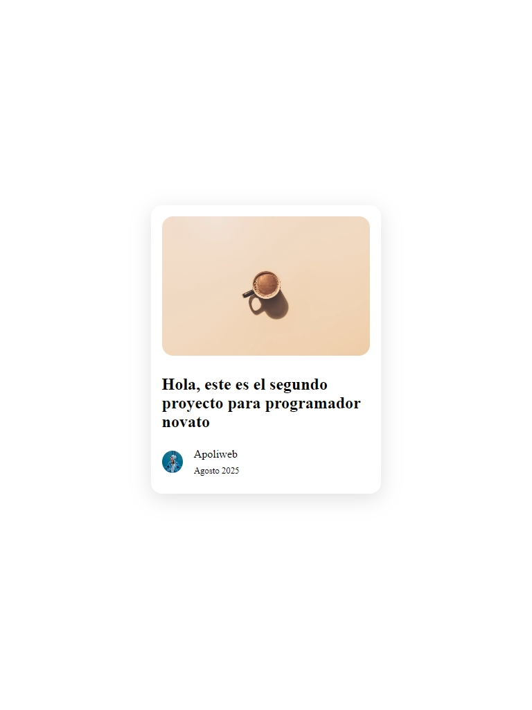

# Práctica 2– Crea tu primer mini proyecto web

¿Te gustaría ver resultados reales mientras aprendes a programar?
En este repositorio encontrarás tu primer paso práctico para lograrlo.

✨ Aquí aprenderás a construir proyectos reales usando solo HTML y CSS, paso a paso, sin complicaciones, y desde cero.

📌 Este proyecto es perfecto para ti si…
✅ Te gusta aprender haciendo.
✅ Te emociona ver cómo tu código toma forma.
✅ Quieres construir tu portafolio desde ya.